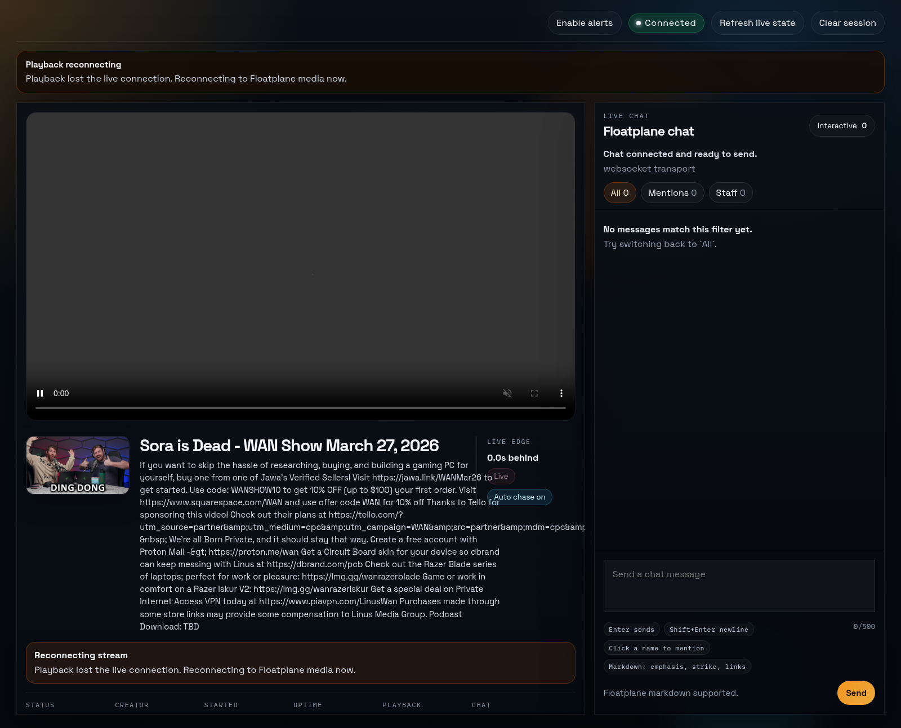

# Unofficial WAN Client

[](https://github.com/NeonN3mesis/unofficial-wan-client/actions/workflows/ci.yml)
[](https://github.com/NeonN3mesis/unofficial-wan-client/releases/latest)
[](https://github.com/NeonN3mesis/unofficial-wan-client/blob/main/LICENSE)

Unofficial WAN Client is a Linux-first desktop client for watching the WAN Show on Floatplane with local playback relay, live chat, desktop notifications, and optional Friday-night auto-watch scheduling.

## Download
- Latest AppImage: <https://github.com/NeonN3mesis/unofficial-wan-client/releases/latest>

Launch the AppImage on Linux after making it executable:

```bash
chmod +x Unofficial.WAN.Client-*.AppImage
./Unofficial.WAN.Client-*.AppImage
```

## Highlights
- Local-only desktop app with a backend bound to `127.0.0.1`
- Managed Chrome/Chromium sign-in flow for using your own Floatplane account
- Opaque local playback routes instead of raw upstream media URLs
- Live chat relay, tray/background mode, and Linux autostart support
- Desktop notifications for go-live, reconnect-required, staff-reply, and metadata-update events
- Mini-player mode, always-on-top, and live playback controls for catching up to the stream
- Recovery notices for reconnect, buffering, and playback problems instead of silent failures
- Optional auto-watch window that can restore the app and start playback when the stream goes live

## Features
- Sign in with your own Floatplane account through a managed local browser flow
- Watch the show in a focused desktop player with live-edge catch-up controls
- Keep chat and playback together in one window instead of juggling browser tabs
- Run the app in the tray and let it auto-open when the WAN Show goes live
- Enable mini-player mode or pin the window on top while doing other things
- Get explicit reconnect and recovery feedback when auth, network, or playback needs attention

## Screenshot


## Quick start
1. Download the latest AppImage from the releases page.
2. Launch the app on Linux.
3. Click `Connect Floatplane`.
4. Finish sign-in in the managed browser window.
5. Return to the app and click `Finish Sign-In`.
6. Optionally enable auto-watch and edit the weekly watch window.

## Desktop defaults
- Auto-watch is off until you enable it.
- The default watch window is Friday, `19:00` to `00:00`, using the local system timezone.
- When auto-watch detects the stream has started, the app restores or opens the main window and starts playback immediately.
- If the saved session is expired during the active watch window, the app opens the reconnect flow automatically.

## Requirements
- Linux x64
- Node.js 20+ for development builds
- A locally installed Chrome or Chromium-based browser for managed sign-in
- Your own Floatplane account

## Development
Install dependencies and run the local app stack:

```bash
npm install
npm run dev
npm run dev:desktop
```

Build and test:

```bash
npm run build
npm test
```

Build a Linux AppImage locally:

```bash
npm run dist:linux
```

## Test auto-watch without a real broadcast
Launch the hidden desktop app and simulate a live launch:

```bash
npm run dev:desktop:simulate-live
```

Launch the hidden desktop app and simulate a reconnect prompt:

```bash
npm run dev:desktop:simulate-reauth
```

Or launch in background and trigger checks manually from the tray:

```bash
npm run dev:desktop:background
```

These Linux dev scripts launch Electron with `--no-sandbox` to avoid the local `chrome-sandbox` SUID requirement inside `node_modules/electron`.

## Local data and security
- Desktop builds store runtime data under the Electron user-data directory, not under `apps/server/data`.
- The embedded server listens on loopback only.
- Playback URLs exposed to the renderer are opaque local routes, not raw upstream fetch targets.
- Clearing the session also tears down managed browser state used by the app runtime.
- Do not share cookies, storage-state files, Chrome profiles, HAR captures, or probe payloads from real accounts.

## Why trust this?
- The full source is public, so you can inspect what the app does before using it.
- The desktop app keeps its local backend on `127.0.0.1` instead of exposing it on your network.
- Floatplane sign-in happens in a managed browser window, not through a custom password form inside the app UI.
- The repo includes a public security review: [security-audit-2026-03-28.md](./docs/security-audit-2026-03-28.md)
- Release artifacts ship with checksums so you can verify what you downloaded.
- You can clear the saved session from the app without manually digging through repo files.

## What data is stored?
- Desktop preferences such as auto-watch settings, mini-player mode, and notification preferences
- Local session and managed-browser state needed to reuse your Floatplane login between launches
- Runtime playback and relay data under the Electron user-data directory
- Temporary in-app state such as live metadata and chat messages while the app is running

The app is designed to keep this data local to your machine. It is not a cloud service, and it does not need an external account beyond your own Floatplane login.

## Known limits
- This is an unofficial client and is not affiliated with Floatplane or Linus Media Group.
- The packaged release is Linux-first.
- Upstream Floatplane changes can break playback, chat, or sign-in behavior without warning.
- Real-world reliability still depends on more live-show usage over time, especially across upstream changes.
- If you are uncomfortable storing a local reusable Floatplane session on your machine, you should use the website instead.

## Contributing
- Contributor guide: [CONTRIBUTING.md](./CONTRIBUTING.md)
- Security policy: [SECURITY.md](./SECURITY.md)
- Release process: [releasing.md](./docs/releasing.md)
